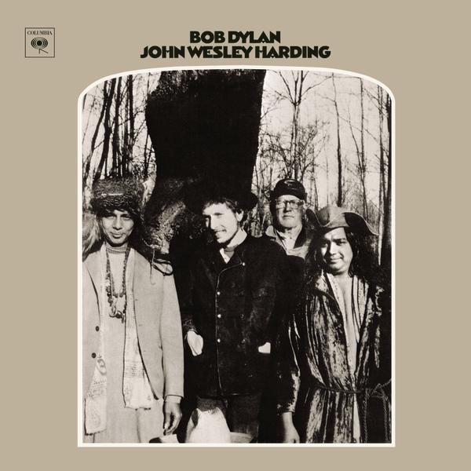

# All Along The Watchtower

乔布斯在与比尔·盖茨一起的访谈中如是说道：

> I think of most things in life as either a Bob Dylan or a Beatles song
> 我觉得一生中许多事暗合鲍勃·迪伦或者披头士的歌曲

乔布斯可算是鲍勃·迪伦与披头士的天字一号粉丝，乔布斯也多次在发布会上提及他们。然而与苹果公司电子产品在国内的流行不同，似乎怎样的推手都无法让鲍勃·迪伦与披头士这样风靡西方世界的歌手在国内流行起来。而音乐版权也一直是一件错综复杂的事，不知是不幸还是有幸，鲍勃·迪伦的歌曲大部分还处于免费状态。希望能够在这一阵短暂的免费时光里，能够有更多的人了解到鲍勃·迪伦的歌曲吧。

《All Along The Watchtower》这首歌收录在1967年12月27日发行的《John Wesley Harding》这张专辑中，这也是他的第八张专辑。此时的迪伦刚刚转型成功，发行了《Blonde on Blonde》与《Highway 61 Revisited》两张重磅专辑，风头正盛，却在巡演之后潜迹藏踪的蛰伏了起来。

鲍勃·迪伦讨厌标签，更讨厌被人贴上标签，从最早在“煤气灯”酒吧演出时，演奏民谣被人贴上乡巴佬的标签。到后来摇身一变成为叱咤风云的“美国民谣之父”，再到后来转型结合摇滚乐让所有人大吃一惊。他不愿意追随什么，不愿意附和什么，不愿意妥协，反对战争，反对种族主义，他独自一人站在瞭望塔上，紧紧地盯着远处即将倾颓的大巴比伦。就是在这样的背景下，迪伦写作了《All Along The Watchtower》

迪伦很多的歌曲都化用圣经之中的故事来进行影射，《All Along The Watchtower》便取材于圣经以赛亚书第21章。原典中的故事讲述了以赛亚受上帝的默示，建立瞭望塔，遥望巴比伦城的方向。而最后巴比伦大城在欲望中倾覆，一队队骑士从远处奔来，高声呐喊巴比伦的覆灭。

> ( 赛 21：5-9 )
> 21.5 他们摆设筵席，派人守望，又吃又喝。首领阿，你们起来，用油抹盾牌。
> 21.6 主对我如此说，你去设立守望的，使他将所看见的述说。
> 21.7 他看见军队，就是骑马的一对一对地来，又看见驴队，骆驼队，就要侧耳细听。
> 21.8 他像狮子吼叫，说，主阿，我白日常站在望楼上，整夜立在我守望所。
> 21.9 看哪，有一队军兵骑着马，一对一对地来。他就说，巴比伦倾倒了。倾倒了，他一切雕刻的神像，都打碎于地。

鲍勃·迪伦的歌词则从一间牢房中展开，登场人物则变成了小丑与小偷。

> “There must be some way out of here,”
> “这里一定有一条路能够离开”
>
> said the joker to the thief
> 小丑曾对贼说，

鲍勃·迪伦选取了两个常见的意象来作为主人公，一位是小丑，一个卑微的手艺人，笑的最多，却最为痛苦的人。在扑克中成为王牌，在塔罗中又象征愚者，是一切的起始。窃贼的形象则更为立体、矛盾、叛逆。道家与儒家一向对窃贼的观点全然不同，《庄子·胠箧》中便有“彼窃钩者诛，窃国者为诸侯”，只凭窃贼二字判断，这位主人公或许是无恶不作的江洋大盗，也有可能是劫富济贫的侠盗。

美国不仅输出了个人英雄主义，同时也输出了大量的反英雄，尽管反英雄到了美国人那里，有了一点儿反英雄的英雄主义意味，但丝毫不影响诸如蝙蝠侠、死侍的流行。站立在超人、美国队长这样光辉伟岸的形象对面的反英雄仍能够获得认同，究其根源是各民族流传着自己的反英雄传说。从欧洲流传下来的大量史诗文学中可窥一斑，诸如凯尔特神话中暴躁的库丘林、英国民间传说中的罗宾汉。其它国家也有不少类似的传说，比如韩国的林巨正、洪吉童，日本的石川五右卫门，美国佬杜撰的佐罗，莫里斯·勒布朗笔下和福尔摩斯打得有来有回的亚森·罗宾。中国则古有盗跖、昆仑奴、一枝梅，近代则有燕子李三、楚留香等文学形象

歌词的第一节，是一段小丑对窃贼的话

> “There must be some way out of here,”
> “这里一定有一条路能够离开”
>
> said the joker to the thief
> 小丑曾对贼说，
>
> “There’s too much confusion,
> 这里有太多的困惑
>
> I can’t get no relief
> 我怎么也无法解脱。
>
> Businessmen, they drink my wine,
> 商人们喝我的酒
>
> plowmen dig my earth
> 农民们挖我的地
>
> None of them along the line
> 他们之中无人能在此时此刻
>
> know what any of it is worth”
> 理解那些事物的价值

